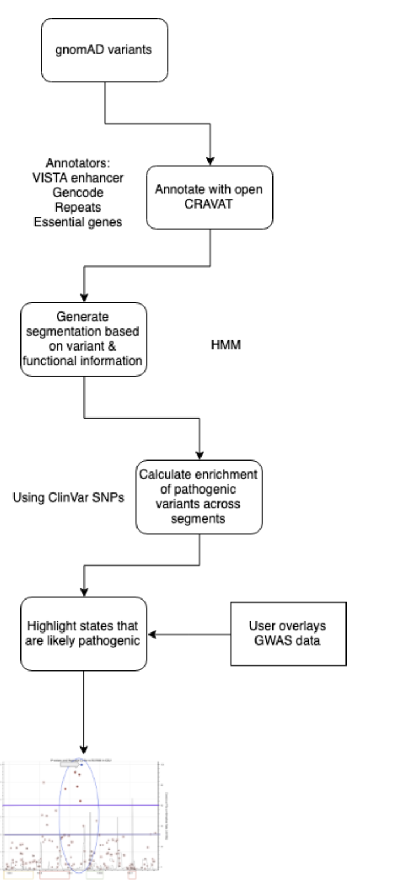

Genome-wide association, further more known as GWAS,  studies have successfully identified many associated genetic loci with complex traits and disease. This association tool are used to compare genotypes (SNP output) and phenotypes (Quanitative trait data) using a linear regression model and plot p-values generated by said model. In analysing the results of these analsis scientist plot the data in a sliding genomic window and gauge the strenght of significants on the p-values of the SNPs. Though this method is sound in the logical intent, recent studies has shown the faults associated with focuesing only on high p-value ranged SNPs when determining the causation of the tested phenotype.///  However, only a small number of biologically causal variants within these loci have been identified. In order to aid in the discovery process to identify etiological variants, we provide a tool to merge GWAS results with a much larger catalog of variants from whole genome sequencing and provide an annotation layer predicting the pathogenic potential of the regions near significant GWAS hits(((Should re-word this to example that it is a layering system. I don't want people to think that the computer will be bias towards the known pathogenic variant sites))).

We hypothesize that there are combinatorial and spatial patterns in the way that variants are distributed thoughout the genome and that this information could be used to infer the pathogenic potential in genomic regions.

As such, we aim to create an annotator which will identify genomic regions or kernels that have similar variant properties. The properties which we will be including are those that are likely to have an effect on the pathogenicity of a variant in a genomic region including: cross-species conservation, regulatory potential of the region, SNP-density, and allele frequencies.

## Approach

We will be using Alzheimer's GWAS data as a test case for this general tool. Variant data from whole-genome-sequencing will be pulled from gnomAD and annotated using Open-CRAVAT. The following Open-CRAVAT annotators will be used:

- Vista Enhancer Browser
- VEST
- Repeat Sequences
- Gencode
- GTEX
- ClinVar
- 1000genomes
- gnomAD
- dbSNP
- COSMIC

This data will be input into a HMM that will learn the patterns of

This web interface will be used to download gNOMAD regions for GWAS studies.
