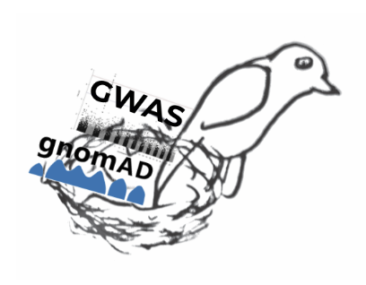
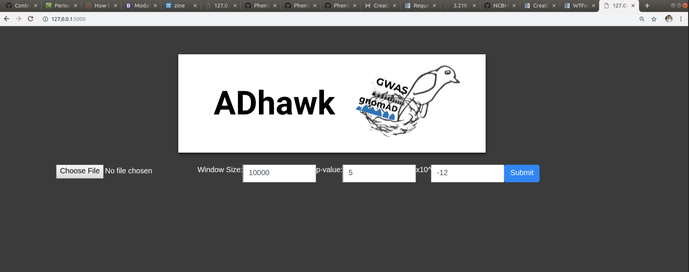
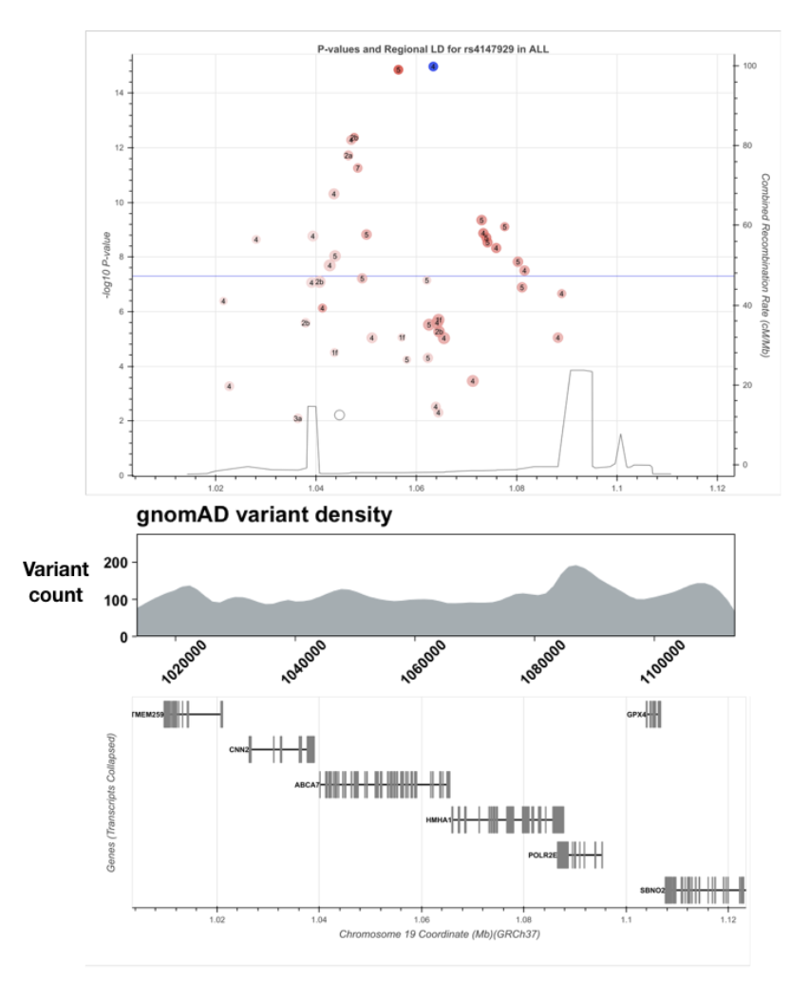

# ADhawk

Genome-wide association studies (GWAS)  have successfully identified many associated genetic loci with complex traits and disease. These association tools are used to compare genotypes (SNP output) and phenotypes (Quantitative trait data) using linear regression models and plot p-values generated by said model. In analysing GWAS results, scientists plot data in a sliding genomic window and gauge the significance of SNPs. Though this method is logically sound, recent studies have shown faults associated with focusing only on insignificant SNPs when determining the causation of the tested phenotype, primarily pathogenic mutations. Only a small number of causal variants within these loci (insignificant) have been identified to be the 
To assist the discovery of etiological variants, we hypothesize that there are combinatorial and spatial patterns in the way variants are distributed throughout the genome and this information could be used to infer pathogenic potential in genomic regions. We hope to provide a tool that merges GWAS results with a much larger catalog of variants from whole genome sequencing and provide an annotation layer showcasing the pathogenic potential of the regions near significant GWAS hits. This new method will allow one to compare SNPs from current experiments with annotated SNPs in the vicinity. The ROI will display general features of the kernel in question, such as. With this, researchers can expedite the analysis phase and also focus on characteristics of SNPs rather than P-value.  

As such, we aim to create an annotator which will identify genomic regions or kernels that have similar variant properties, mainly those likely to have an effect on pathogenicity in a genomic region including: cross-species conservation, regulatory potential of the region, SNP density, and allele frequencies.

## Approach

In the region of interest shown, there are 46 variants in the GWAS results, however in that some region there are 11,451 variants.  

GWAS and gnomAD agregation:
* GWAS is an extremely valuable tool to investigate the relationship between traits and their underlying genetics
* However, GWAS data is limited to only variants in the data set, which are associated with the genomic region but not often causal for the trait.
* gnomAD aggregates whole exome and whole genome sequencing data from 141,456 individuals and contains a much broader set of variants than a GWAS study
* Ad Hawk is a tool that combines the power of GWAS studies with the vast database of gnomAD.
* Users upload GWAS data of interest and Ad Hawk filters the significant GWAS variants and outputs all gnomAD data within a specified window. 
* AD Hawk allows users to quickly aggregate whole genome sequencing data and identify other genomic variants in regions significantly associated with their trait of interest. 

Identification of Pathogenic ROIs from GWAS data
The purpose of this section is to rank prioritize potential ROIs that may be implicated in AD. Using GWAS data obtained from CRAVAT we were able to reduce the featureset into a set of clusters that may help define these ROIs. 

Once the feature sets for each cluster have been defined we hope to implement an HMM to represent these patterns which can then be applied to the entire chromosome/genome, allowing us to prioritize these regions. 

The analysis was conducted in a Jupyter notebook using primarily the pandas and sk-learn packages to assist with data munging and clustering/plotting. This can easily be scripted into the backend of a greater framework which we hope to provide as a means for researchers to visually interact with the data.

There is much more to be done for the data analysis, mainly extracting information from the many datasets which we were not able to incorporate into the analysis. There are also many other databases which could be queried in CRAVAT.
